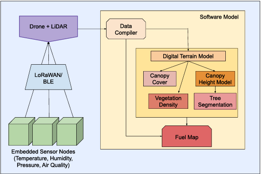
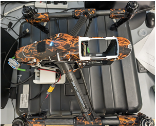
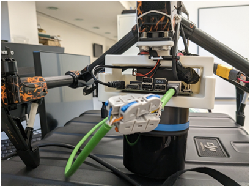

# Software  

## Installations   

As this device is a prototype, multiple version support is not available for this device,
so the installation and dependencies are very specific and must be followed exactly to guarantee
proper functionality using the SICK and ROS libraries. The following steps describe the exact
installation procedure which must be done in order to run the appropriate libraries.  

1. First make sure that you have a computer running Ubuntu 20.04 and is using python version 2.7.10.   
2. Install ROS Noetic by executing the following instructions:  
    a. sudo sh -c 'echo "deb http://packages.ros.org/ros/ubuntu $(lsb_release -sc) 
main" > /etc/apt/sources.list.d/ros-latest.list'   
    b. sudo apt install curl # if you haven't already installed curl   
    c. curl -s https://raw.githubusercontent.com/ros/rosdistro/master/ros.asc | sudo apt-key add -   
    d. sudo apt update   
    e. sudo apt install ros-noetic-desktop-full   
    f. source /opt/ros/noetic/setup.bash   
    g. sudo apt install python3-rosdep python3-rosinstall python3-rosinstall-generator python3-wstool build-essential   
    h. sudo apt install python3-rosdep  
    i. sudo rosdep init   
    j. rosdep update   
 3. Next directly install SICK libraries using the following:   
    a. sudo apt update   
    b. sudo apt-get install ros-noetic-sick-scan-xd   
 4. Next install the libraries necessary for operating our specific device:   
    a. git clone https://github.com/Hazard-Harbingers-EC463/LiDAR_Detector_Drone_HH.git   
    b. From the cloned repository, add the laser_to_pcl folder with all of its contents to the ROS repository with the rest of the launch files, which if you followed all of the previous steps without changing directories, would be /opt/ros/noetic/share/   
    c. Install the latest version of FUSION   
    d. Install PDAL package   
        i. conda create --yes –name myenv --channel conda-forge pdal   
        ii. conda update pdal   
        iii. conda activate myenv   
        iv. conda install matplotlib  

## Collecting LiDAR data
1. Attach a mobile viewing platform such as a tablet or monitor to the display port on the Jetson Nano to gain access to the Jetson.  
2. Start a scan using the following commands:  
    a. Open 2 terminals  
    b. In the 1st terminal, run: roslaunch sick_scan_xd sick_multiscan.launch hostname:=192.168.0.2 udp_receiver_ip:=192.168.0.3  
    c. In the 2nd terminal, run: rosbag record /cloud_all_fields_fullframe  
3. When the scan is started, the user can unplug the display, and fly the drone as if a regular drone around the area they wish to scan. The LiDAR scans in 360 degree range so the direction in which the drone is facing is irrelevant for the scan. In order to ensure accuracy of the scans and usability by models, the scan should feature below and above canopy flight in the same flight duration. Once the flight is finished, the user can plug in the display again, stop the scan, and access the created rosbag file. The next step is to concatenate it and produce a las file.   

## Converting ROSBAG to LAS
1. Run the command "roscore" 
2. Run the command "rqt_bag" in the directory with the rosbag. This brings up a user UI where you can choose the rosbag file and right click on the created stream to publish the data to topic /cloud_all_fields_fullframe 
3. Run the command "roslaunch laser_to_pcl start.launch 
4. Run the command "rosrun laser_to_pcl laser2pcl.py" It will output a command line counter of all the pcd points gather. Run the command until the counter does not change. 
5. Run the command "rosbag record /laser_pointcloud" until it gives buffer size reached warning 
6. Run the command “rosrun pcl_ros bag_to_pcd <input.bag> /laser_pointcloud <pcd_output_directory>”, where input.bag is the resulting rosbag file from step 5.
7. In pcd_output_directory, run the command “pdal translate <input.pcd> <output.las>”. Let the current directory be DATA_DIR.

## Producing 3D models
1. Change the directory to where the Hazard-Harbingers-EC463 github repository was cloned to 
2. Run: cd Models 
3. Run: ./processData.sh 
4. When a prompt for a file path appears, input the file path to the output LAS file in DATA_DIR. 
5. The resulting models and 2D heat maps are stored in DATA_DIR/outputs folder. The user can also extract the SD card from the collector node and process the stored CSV data as needed. 

## Code overview

The following image shows a block diagram for an overview of the software modules.  
 

### Collecting data
The first component in our system is the aerial LiDAR system (ALS), which 
includes a 360° LiDAR. The drone, mounted with the LiDAR and a Jetson Nano, scans 
above and below the canopy to provide data on the vegetation and topography of a forest 
region. This captured data, which is stored as a bag file created by a tool called rosbag, is 
first converted to a single PCD file. Refer to the code in ./lidarLaserAssembler/laser_to_pcl/src/laser2pc.py.
The bag file is first ran so that its data is continuously published to a topic called '/cloud_all_fields_fullframe'. Then, a tool called Laser Assembler assembles the published data into a single PCD file. Finally, this PCD file is converted to a LAS file using PDAL so that it can be inputted into processData.sh. This LAS file can be viewed as a 3D point cloud using LDV.  

The ALS system can be shown below:  
  
   

A diagram to explain how the laser assembler works:   

### Producing the Models

After the preprocessing step, we derive several models from the 3D point cloud: 
digital terrain model (DTM), canopy height model (CHM), tree segmentation, canopy 
cover model, and vegetation density models. These models are created using the shell script in ./Models/processData.sh. This script uses tools for processing LiDAR data called FUSION and LAStools. First,the 
DTM provides valuable information about the land’s topography, such as the terrain and 
the direction of the slope. This model is created by first filtering out the ground points 
(GroundFilter from FUSION) and then interpolating those points to create a smooth 
surface (GridSurfaceCreate from FUSION). Second, the CHM provides information 
about the height and structure of the vegetation, which is produced by taking the highest 
elevation in each grid cell and subtracting the ground elevations.   
   
Next, to model the density and distribution of trees, we identify tree segments 
using TreeSeg from FUSION, which applies a watershed segmentation algorithm to the 
CHM and results in a CSV file. Subsequently, the  percentage of canopy cover and 
vegetation density, which ranges between 0% and 100%, at different height stratas in 
each region is calculated to create a canopy cover model and vegetation density models, 
both of which use Cover from FUSION. These models result in DTM files. Finally, to 
better visualize the tree clusters, canopy cover percentages, and vegetation density, a 
python script in ./Models/visualize2D.py reads from the CSV and DTM files to plot them as a heat map.  

## Potential Issues
Since the SICK multiscan itself is a prototype, there may be issues with using the SICK 
library commands. Since we are simply using those libraries to operate the LiDAR, 
abnormal operations could arise with the libraries used from SICK. In that case we highly 
recommend looking at the SICK github (https://github.com/SICKAG/sick_scan_xd) for 
support on library issues. Same applies to using ROS functions.  

As for our device, abnormal operations could arise with either the software written to 
concatenate scans or with node information transmission.   

For the scans, if the user manual has an issue with the counter for the cloud being zero 
without ever updating, then it is recommended to check the following common issues: 
1. Check to make sure that clock is set to the correct time. The bag read operation is 
tied to the clock of the Jetson and if the time is set differently during the scan vs during 
the playback during rosbag record, the concatenator will not find any points in the correct 
time range to record.  
2. Check to make sure that  roscore  is running and  try rebooting it.   
3. If the issues persist, reboot the entire Jetson and retry the network connection as 
sometimes it does not properly connect with the specified network connection and 
becomes incapable of performing the concatenation.
